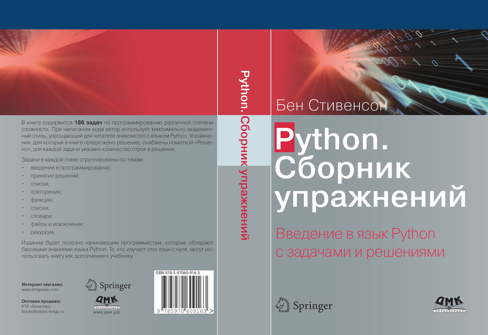

# Решения 186 задач из книги Бена Стивенсона на русском

Добро пожаловать в репозиторий, содержащий решения всех 186 задач из книги Бена Стивенсона, переведенной на русский язык и изданной издательством DMK Press в 2021 году.

## Описание

В этом репозитории вы найдете:

- Решения всех 186 задач, представленных в книге.
- Текстовые файлы с данными для задач, связанных с обработкой файлов.

## Структура репозитория

- `images/` - Папка, содержащая изображение обложки книги.
- `BenStevensonExs/` - Папка, содержащая решения задач.
- `1-100/` - Папка, содержащая решения задач от 1 до 99.
- `100-186/` - Папка, содержащая решения задач от 100 до 186, включает в себя текстовые файлы и папку `names`, необходимые для решения задач с файлами
- `Памятка/` - Папка, содержащая краткие выкладки по темам книги.
## Обложка книги

## Лицензия

Этот проект лицензирован под лицензией MIT. Подробности смотрите в файле [LICENSE](LICENSE).
